### Linux系统与网络管理 实验报告1
### 实验名称
- 无人值守Linux安装镜像制作

### 实现特性
- 定制一个普通用户名和默认密码
- 定制安装OpenSSH Server
- 安装过程禁止自动联网更新软件包

### 实验过程
- 1.软件环境
 - Windows 10
 - VirtualBox
 - ubuntu 16.04.4 server 64bit  


- 2.启动已经安装好的Ubuntu Server（记得在此虚拟机未启动的时候设置该虚拟机的两块网络网卡：host-only和NAT）


- 3.在Windows环境下下载putty


- 4.在步骤2启动的虚拟机命令行输入命令:ifconfig 查看网卡状态，有网卡未启动，手动启动并动态获取IP：
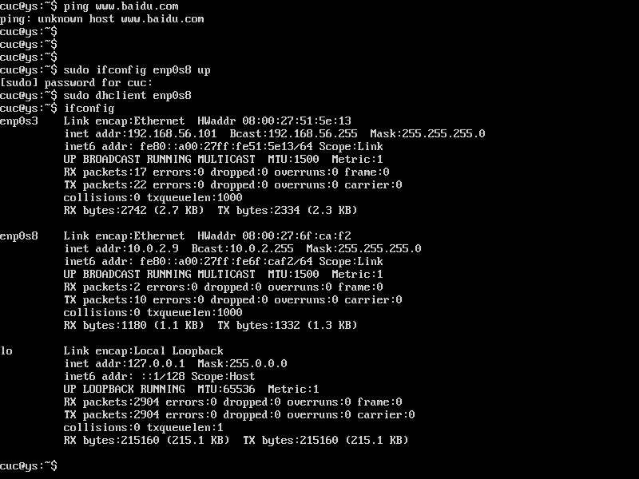  
重新查看网卡IP为：192.168.56.101

- 5.在虚拟机上安装ssh服务：  
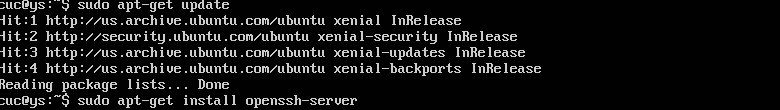  
检查ssh服务已开启：  
    
使用putty连接这台虚拟机，注意Saved Sessions为虚拟机名，保存为默认。点击open出现警告：  
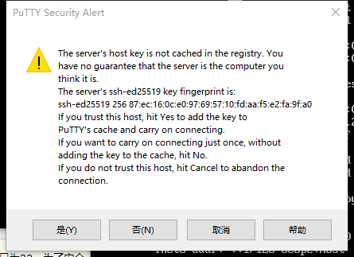    
直接选择“是”即可。使用虚拟机用户名和密码进行连接：  
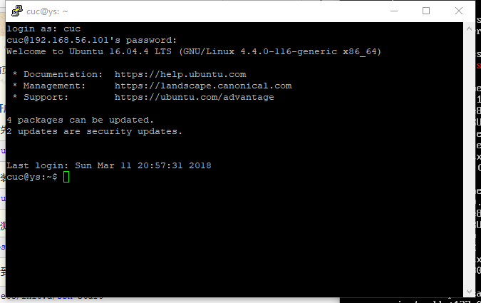


- 6.把用于ubuntu16.04.1镜像文件从Windows复制进虚拟机:/home/cuc，使用psftp:

```
put ubuntu-16.04.4-server-amd64.iso
```

- 7.回到putty登录的虚拟机命令行执行以下命令  

```
# 在当前用户目录下（/home/cuc）创建一个用于挂载iso镜像文件的目录
mkdir loopdir  

# 挂载iso镜像文件到该目录
mount -o loop ubuntu-16.04.1-server-amd64.iso loopdir

# 创建一个工作目录用于克隆光盘内容
mkdir cd

# 同步光盘内容到目标工作目录
# 一定要注意loopdir后的这个/，cd后面不能有/
rsync -av loopdir/ cd

# 卸载iso镜像
umount loopdir
```  
命令执行成功后：  
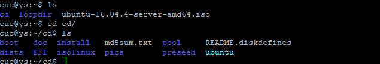

```
# 进入目标工作目录
cd cd/

# 编辑Ubuntu安装引导界面增加一个新菜单项入口
vim isolinux/txt.cfg
添加以下内容到该文件后强制保存退出
label autoinstall
  menu label ^Auto Install Ubuntu Server
  kernel /install/vmlinuz
  append  file=/cdrom/preseed/ubuntu-server-autoinstall.seed debian-installer/locale=en_US console-setup/layoutcode=us keyboard-configuration/layoutcode=us console-setup/ask_detect=false localechooser/translation/warn-light=true localechooser/translation/warn-severe=true initrd=/install/initrd.gz root=/dev/ram rw quiet
```  
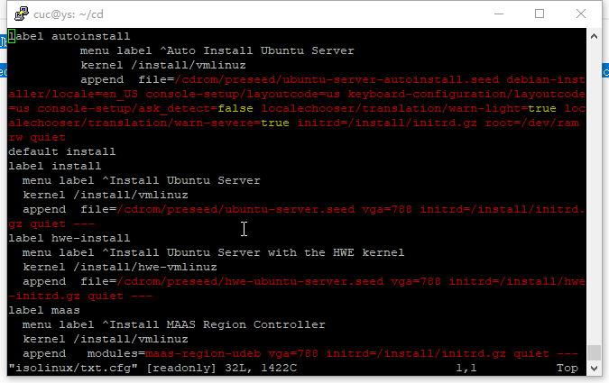  


```  
使用老师提供的ubuntu-server-autoinstall.seed，并将该文件保存到刚才创建的工作目录：/home/cuc/cd/preseed/
```  
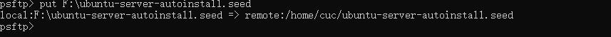  


```
修改isolinux/isolinux.cfg，增加内容timeout 10（可选，否则需要手动按下ENTER启动安装界面）
```  
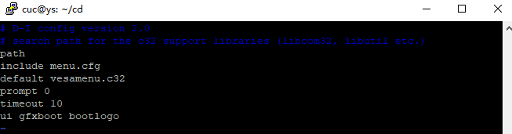  


```
# 重新生成md5sum.txt
sudo -s #提升权限
cd /home/cuc/cd && find . -type f -print0 | xargs -0 md5sum > md5sum.txt
```  
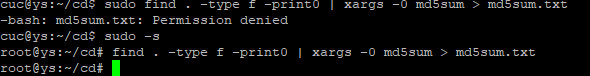  


```
# 封闭改动后的目录到.iso
IMAGE=custom.iso
BUILD=/home/cuc/cd/

mkisofs -r -V "Custom Ubuntu Install CD" \
            -cache-inodes \
            -J -l -b isolinux/isolinux.bin \
            -c isolinux/boot.cat -no-emul-boot \
            -boot-load-size 4 -boot-info-table \
            -o $IMAGE $BUILD
```  
出现错误，按照提示安装genisoimage，再重新执行,执行成功后cd目录下多出一个custom.iso，这就是我们制作的无人值守Linux安装镜像：   
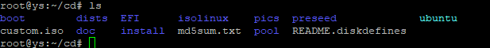

- 8.从虚拟机中将custom.iso这个镜像文件复制出来  
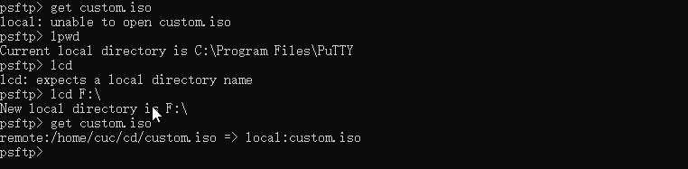  
出现错误"unable to open xxx"：权限不够，无法将custom.iso复制到C盘ProgramFiles下，更改目标目录即可，解决方案参考链接：  
[Using psftp to upload and download files](https://superuser.com/questions/232395/using-psftp-to-upload-and-download-files)

- 9.使用制作好的镜像安装Linux系统：  
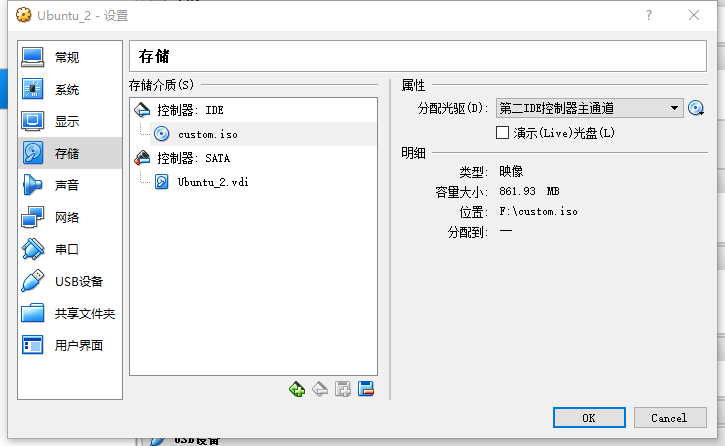  
第一次安装时出现以下错误：  
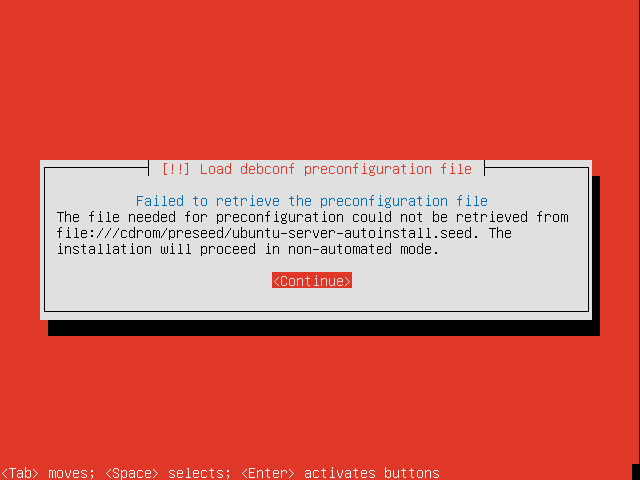  
发现是ubuntu-server-autoinstall.seed没有复制到正确的路径下，修改后重新制作的iso可以成功安装：  
  

### 实验问题
- 对比老师制作的seed文件和示例文件的不同(左为官方文件，右为老师修改后文件)
 - 在线文本比较  
 [http://www.jq22.com/textDifference](http://www.jq22.com/textDifference)
 - 选择支持的地点
 - 跳过语言支持询问  
     
 - 修改链接等待时间为5秒
 - 修改dhcp等待时间为5秒
 - 关闭网络自动设置  
 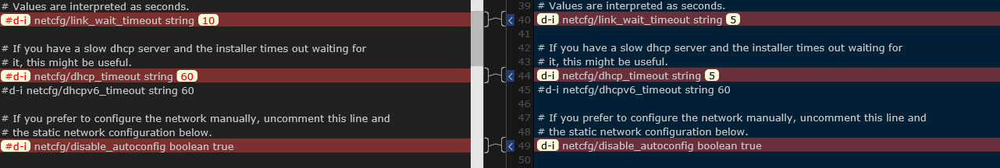  
 - 静态设置ip为：192.168.138.42
 - 静态设置子网掩码为：255.255.255.0
 - 静态设置网关为：192.168.138.1
 - 静态设置域名解析服务器为：192.168.138.1
 - 开启静态设置  
 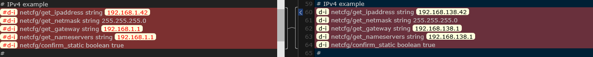
 - 设置默认主机名为：svr.sec.cuc.edu.cn
 - 设置域名为：dns.sec.cuc.edu.cn
 - 设置主机名为：isc-vm-host
 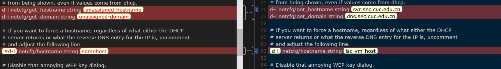
 - 设置用户全名：cuc
 - 设置用户名：cuc
 - 设置密码为：sec.cuc.edu.cn
 - 重复确认密码
 
 - 设置时区为：亚洲/上海
 - 不使用ntp设置时间
 - 选择最大的空闲空间进行自动分区
 
 - lvm分区设置
 - 选用muiti方式
 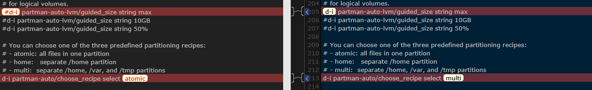
 - 不使用网络下载镜像
 
 - 选用server版安装包
 - 预安装openssh-server
 - debootstrap后不更新包
 - 自动安全更新
 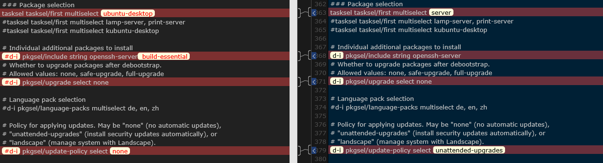

- Virtualbox安装完Ubuntu之后新添加的网卡如何实现系统开机自动启用和自动获取IP？
 - 在/etc/network/interfaces文件中添加：
 ```
 auto enp0s8
 iface enp0s8 inet dhcp
 ```
 - 配置前  
 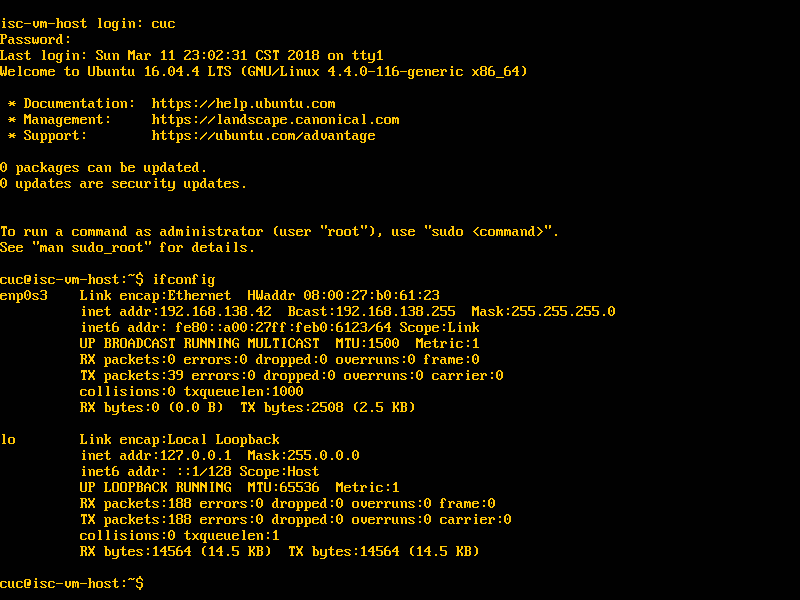
 - 配置后重启,host-only网卡自动获得了ip地址  
 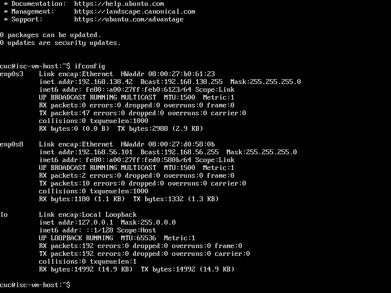  

 疑问：没有修改其他设置，为什么重启后字体颜色变了？？


- 如何使用sftp在虚拟机和宿主机之间传输文件？
 - 使用psftp
 ```
 get filename 虚拟机->宿主机
 put filename 宿主机->虚拟机
 lpwd 查看当前本地目录
 lcd path 更改本地目录
 ```

### 参考链接
[无人值守Linux安装镜像制作:http://blog.csdn.net/qq_31989521/article/details/58600426](http://blog.csdn.net/qq_31989521/article/details/58600426)
