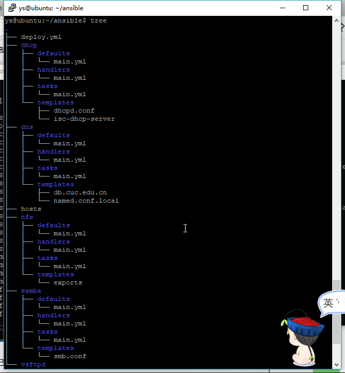
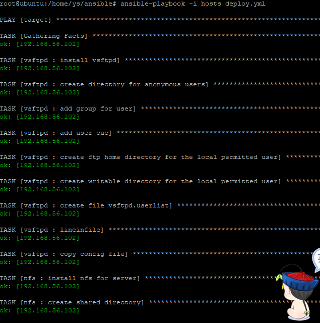

### Linux系统与网络管理 实验报告7
### 实验名称
- 使用ansible技术重构FTP、NFS、DHCP、DNS、Samba服务器的自动安装与自动配置

### 实验过程
- root免密登录见实验六
- 在deploy.yml中用roles定义不同任务：每个roles中tasks执行主脚本，实现配置功能；defaults定义配置变量信息；handlers负责配置后的重启服务；templates是改动好的定制配置文件

- 
- 运行结果  

