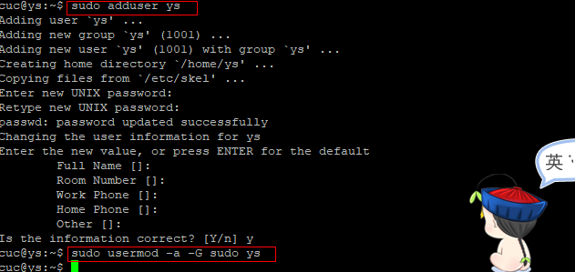
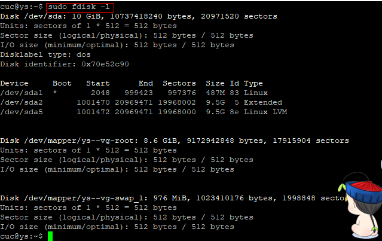
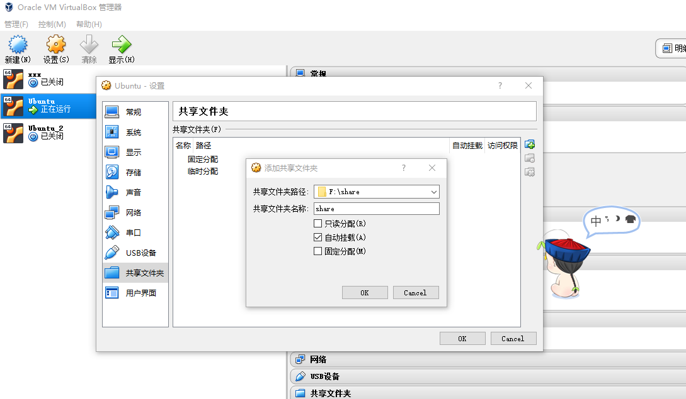
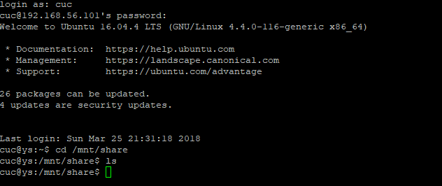

### Linux系统与网络管理 实验报告3
### 实验名称
- systemd入门

### 实验过程
- 命令篇
  - [系统管理](https://asciinema.org/a/CtyeADOk3UajmIJF0OV9tTgIg)
  - [Unit](https://asciinema.org/a/pVkxMAOLpqxqmyL8nFWtUm3RS)
  - [Unit的配置文件](https://asciinema.org/a/JZTNVKJPxCqvc2jJV5OWDBGzr)
  - [Target](https://asciinema.org/a/oBs7jbyVbf63RzTZ0OXhWnzBt)
  - [日志管理](https://asciinema.org/a/7TdhmwGSni8PzduHxAfIfHI9S)
- 实战篇
  - [基本指令](https://asciinema.org/a/7f5EjnLv1FeBqpJUsKnSFeq6H)

### 自查清单
- 如何添加一个用户并使其具备sudo执行程序的权限?  


- 如何将一个用户添加到一个用户组？  
  

- 如何查看当前系统的分区表和文件系统详细信息？  


- 如何实现开机自动挂载Virtualbox的共享目录分区?
  - 1.设置VirtualBox共享的本地文件夹,如F盘下的share，此文件夹中有一个test.txt文件：  
  

  - 2.进入Ubuntu系统，创建一个共享目录：
  ```
  mkdir /mnt/share
  ```
  - 3.挂载  
  ```
  mount -t vboxsf share /mnt/share
  ```
  出现错误："mount: unknown filesystem type 'vboxsf' ",
  根据：[mount gives unknown filesystem type 'vboxsf'](https://superuser.com/questions/496513/mount-gives-unknown-filesystem-type-vboxsf),需要安装增强功能：
  ```
  sudo apt install virtualbox-guest-x11
  ```  
  安装完后再执行挂载命令，出现错误：  
    
  解决方案参考：  
  [VirtualBox: mount.vboxsf: mounting failed with the error: No such device](https://stackoverflow.com/questions/28328775/virtualbox-mount-vboxsf-mounting-failed-with-the-error-no-such-device)  
  执行：
  ```
  modprobe -a vboxguest vboxsf vboxvideo
  ```  
  挂载成功：  
  
  - 4.实现开机自动挂载功能
  在/etc/rc.local中加入挂载命令：  
  ```
  mount -t vboxsf share /mnt/share
  ```  
  但是没有成功，重启后/mnt/share文件夹下没有文件：  
  


- 基于LVM（逻辑分卷管理）的分区如何实现动态扩容和缩减容量？  
  - 显示分区情况  
    
  - 扩容  
    
  - 减容  
    


- 如何通过systemd设置实现在网络连通时运行一个指定脚本，在网络断开时运行另一个脚本？  
  - 修改networking.service文件，添加两行:  
    
  其中，1.sh,2.sh分别为输出一句相应提示信息到output文件  
    


- 如何通过systemd设置实现一个脚本在任何情况下被杀死之后会立即重新启动？实现杀不死？  
  - 修改该脚本的配置文件[service]部分   
  ```
  Restart:always
  ```

### 参考链接
- [Linux命令大全: 逻辑卷相关](http://man.linuxde.net/?s=lv)
- [systemd入门教程：命令篇](http://www.ruanyifeng.com/blog/2016/03/systemd-tutorial-commands.html)
- [systemd入门教程：实战篇](http://www.ruanyifeng.com/blog/2016/03/systemd-tutorial-part-two.html)
