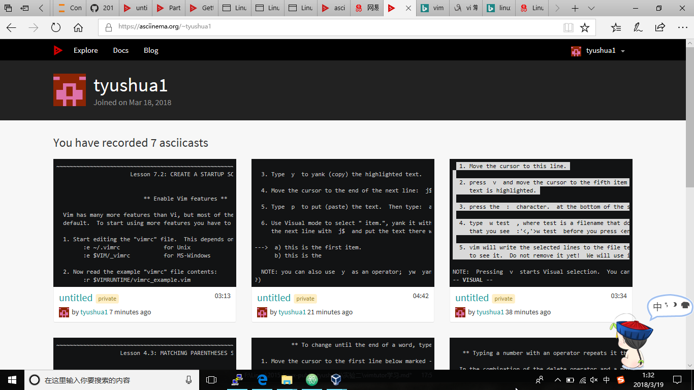
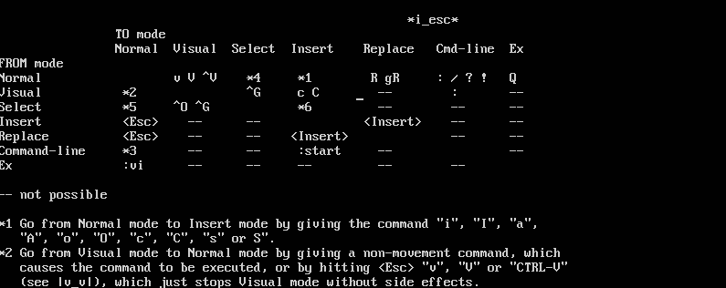
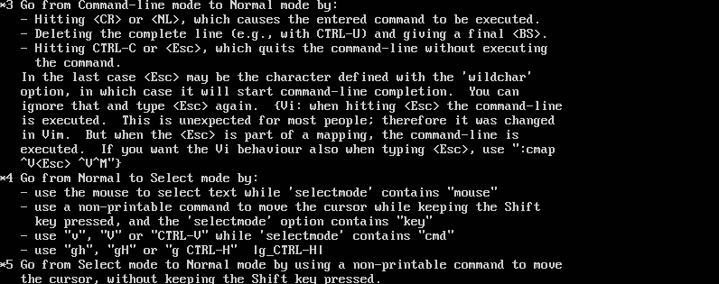

### Linux系统与网络管理 实验报告2
### 实验名称
 - vimtutor学习

### 实验过程
- 配置录屏工具asciinema
  - 安装
 ```
  sudo apt-add-repository ppa:zanchey/asciinema
  sudo apt-get update
  sudo apt-get install asciinema
```
  - 关联asciinema
```
asciinema auth
```



- 学习vimtutor
  - [lesson 1](https://asciinema.org/a/doJRrxiCpX9gzPlw4v12qrzQX)
  - [lesson 2](https://asciinema.org/a/PrV9B6JpZrV8zoJPer14YheyV)
  - [lesson 3](https://asciinema.org/a/hijLmYxqZRAsMO37ovNujQ5JX)
  - [lesson 4](https://asciinema.org/a/ma5knW2UgjwMtFbTrxc5nEJMG)
  - [lesson 5](https://asciinema.org/a/mDxFTH1ZiIAgWpTfIiq4aRgUa)
  - [lesson 6](https://asciinema.org/a/oDgpbAqRb4kgD7L78mPM8cwx8)
  - [lesson 7](https://asciinema.org/a/ZcrENWTz2Qk9iuk5xwpk5nOdQ)

- 自查清单
  - 你了解vim有哪几种工作模式？
    - Normal Mode：打开编辑器时初始进入的模式，可执行很多指令，如x：删除光标处字符等
    - Visual Mode：所选中区域高亮，然后作为其它指令执行的内容
    - Select Mode：输入一个可打印字符会替换原来选中的内容，然后进入Insert模式
    - Insert Mode：所输入的内容会编辑到文本中
    - Command-line Mode：可执行一条命令
    - Ex mode：类似command-line模式，但是执行一个命令后任然留在Ex模式
    - 模式之间的转换
      
    
    
  - Normal模式下，从当前行开始，一次向下移动光标10行的-操作方法？如何快速移动到文件开始行和结束行？如何快速跳转到文件中的第N行？
    - 光标下移10行：10j
    - 快速移动到文件开始行：gg
    - 快速移动到文件结束行：G
    - 移动到文件的第N行：NG
  - Normal模式下，如何删除单个字符、单个单词、从当前光标位置一直删除到行尾、单行、当前行开始向下数N行？
    - 删除单个字符：x
    - 删除单个单词：dw
    - 从当前光标删除到行尾：d$
    - 删除单行：dd
    - 删除从当前行下数N行：Ndd
  - 如何在vim中快速插入N个空行？如何在vim中快速输入80个-？
    - 插入N个空行：No
    - 输入80个-：80i-ESC
  - 如何撤销最近一次编辑操作？如何重做最近一次被撤销的操作？
    - 撤销最近一次编辑操作：u
    - 重做最近一次被撤销的操作：Ctrl+R
  - vim中如何实现剪切粘贴单个字符？单个单词？单行？如何实现相似的复制粘贴操作呢？
    - 剪切粘贴单个字符x p或d p
    - 剪切粘贴单个单词dw p
    - 剪切粘贴单行dd p
    - 复制粘贴：按v进入visul模式选择要进行复制的内容，退出到Normal模式后，按下p进行粘贴
  - 为了编辑一段文本你能想到哪几种操作方式（按键序列）？
    - :q! 不保存退出
    - :wq 保存并退出
    - :w filename 新建文件并保存到该文件中
  - 查看当前正在编辑的文件名的方法？查看当前光标所在行的行号的方法？
    - Ctrl+G
  - 在文件中进行关键词搜索你会哪些方法？如何设置忽略大小写的情况下进行匹配搜索？如何将匹配的搜索结果进行高亮显示？如何对匹配到的关键词进行批量替换？
    - 向前搜索关键词：/xxx
    - 向后搜索关键词：?xxx
    - 忽略大小写匹配搜索：:set ic
    - 搜索结果高亮显示：set hls is
    - 匹配结果批量替换：:%s/old/new/g
  - 在文件中最近编辑过的位置来回快速跳转的方法？
    - 向前：Ctrl+O
    - 向后：Ctrl+I
  - 如何把光标定位到各种括号的匹配项？例如：找到(, [, or {对应匹配的),], or }
    - 将光标移动到将要匹配的项，按下%
  - 在不退出vim的情况下执行一个外部程序的方法？
    - :!+command
  - 如何使用vim的内置帮助系统来查询一个内置默认快捷键的使用方法？如何在两个不同的分屏窗口中移动光标？
    - :help
    - Ctrl+w

### 参考链接
[asciinema的安装与使用](https://asciinema.org/docs/getting-started)
