### Linux系统与网络管理 实验报告5
### 实验名称
- SHELL脚本编程练习进阶：FTP、NFS、DHCP、DNS、Samba服务器的自动安装与配置

### 实验环境
 - 工作主机：Ubuntu-server-16.04  (192.168.56.101)
 - 目标主机：Ubuntu-server-16.04  (192.168.56.102)
 - 实验要求：自动安装与自动配置过程的启动脚本要求在本地执行（提示：配置远程目标主机的SSH免密root登录，安装脚本、配置文件可以从工作主机（执行启动脚本所在的主机）上通过scp或rsync方式拷贝或同步到远程目标主机，然后再借助SSH的远程命令执行功能实现远程控制安装和配置ssh免密root登录）
   - 目标主机
     - 修改配置文件 /etc/ssh/sshd_config  
     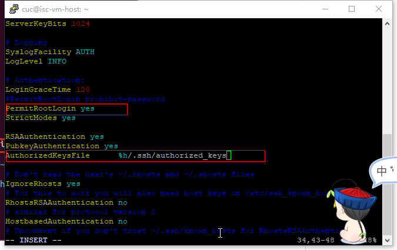
   - 工作主机
     - 生成公私钥，将公钥追加到目标主机/root/.ssh/authorized_keys文件中  
     ```Shell
     ssh-keygen -t rsa
     scp .ssh/id_rsa.pub cuc@192.168.56.102:/home/cuc
     cat /home/cuc/id_rsa.pub >>/root/.ssh/authorized_keys
     ```  

   - root用户免密登录：工作主机->目标主机  
   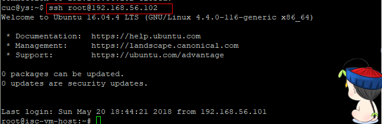  
   - 参考链接  
   [https://www.cnblogs.com/huxinga/p/6418790.html](https://www.cnblogs.com/huxinga/p/6418790.html)  
   [https://blog.csdn.net/sinat_35820101/article/details/78393088](https://blog.csdn.net/sinat_35820101/article/details/78393088)

### FTP
 - [proftpd.conf]()
 - 配置一个提供匿名访问的FTP服务器，匿名访问者可以访问1个目录且仅拥有该目录及其所有子目录的只读访问权限  
 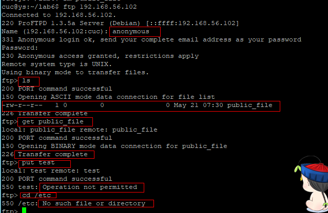

 - 配置一个支持用户名和密码方式访问的账号，该账号继承匿名访问者所有权限，且拥有对另1个独立目录及其子目录完整读写（包括创建目录、修改文件、删除文件等）权限    
 ```
 #AuthOrder              mod_auth_file.c mod_auth_pam.c* mod_auth_unix.c
AuthOrder               mod_auth_file.c  mod_auth_unix.c
#同时支持匿名用户和帐号密码方式登录
AuthUserFile /etc/proftpd/ftpd.passwd
AuthUserFile /etc/proftpd/ftpd.group
 ```
 - 添加用户  
 ```
 ftpasswd --passwd --file=/etc/proftpd/ftpd.passwd --name=ftp_user1 --uid=1000 --home=/home/ftp_user1 --shell=/sbin/nologin
#添加虚拟用户 uid=1000(用户cuc的uid) 目录为/home/ftp_other 以cuc的身份写入  同时禁止系统shell登录
ftpasswd --group --file=/etc/proftpd/ftpd.group --name=ftp_group --gid=1000
#添加用户组
ftpasswd --group --name=ftp_group --gid=99 --member=ftp_user1
#将用户添加如用户组
 ```
 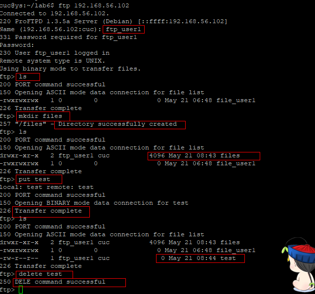

 - FTP用户不能越权访问指定目录之外的任意其他目录和文件
 ```
 DefaultRoot                     ~
 ```
 - 匿名访问权限仅限白名单IP来源用户访问，禁止白名单IP以外的访问；
 ```
 #Anonymous模块内加入
<Limit LOGIN /home/ftp/*>
Order allow,deny
Allow from 192.168.56.101
Deny from all
</Limit>
 ```


### NFS

 - [config:exports](conf/exports)
 - 在1台Linux上配置NFS服务，另1台电脑上配置NFS客户端挂载2个权限不同的共享目录，分别对应只读访问和读写访问权限；
   - server
   ```
   sudo apt install nfs-kernel-server
   #创建两个共享目录
   # /usr/nfs/common 可读可写
   # /usr/nfs/only_read 只读
   ```
   - client
   ```
   sudo apt install nfs-common
   ```  
   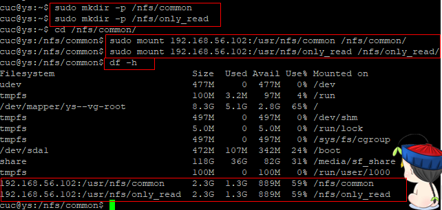
   - 实验报告中请记录你在NFS客户端上看到的：
     - 共享目录中文件、子目录的属主、权限信息;你通过NFS客户端在NFS共享目录中新建的目录、创建的文件的属主、权限信息
     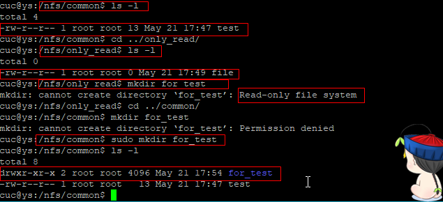
     -  上述共享目录中文件、子目录的属主、权限信息和在NFS服务器端上查看到的信息一样吗？无论是否一致，请给出你查到的资料是如何讲解NFS目录中的属主和属主组信息应该如何正确解读   
     一致
     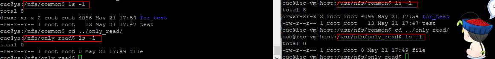
 - 参考  
 [https://www.digitalocean.com/community/tutorials/how-to-set-up-an-nfs-mount-on-ubuntu-16-04](https://www.digitalocean.com/community/tutorials/how-to-set-up-an-nfs-mount-on-ubuntu-16-04)


### DHCP
 - [config: /etc/default/isc-dhcp-server](conf/isc-dhcp-server)
 - [config: /etc/dhcp/dhcpd.conf](conf/dhcpd.conf)
 -  2台虚拟机使用Internal网络模式连接，其中一台虚拟机上配置DHCP服务，另一台服务器作为DHCP客户端，从该DHCP服务器获取网络地址配置
   - server (10.0.2.11 自己指定)
   ```
   sudo apt install isc-dhcp-server
   ```  
   - 修改/etc/default/isc-dhcp-server文件
   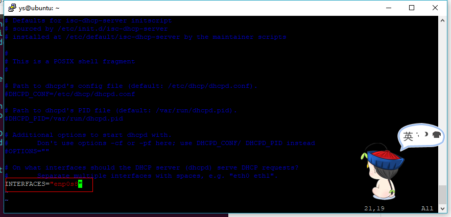  
   - 修改/etc/dhcp/dhcpd.conf文件  
   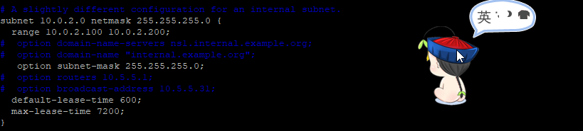  
   - 重启服务：sudo service isc-dhcp-server restart  
   - client (10.0.2.100 由dhcp服务获取)
     - 更改/etc/network/interfaces文件
     
     - 重启网络sudo /etc/init.d/networking restart
     - dhcp前后对比  
     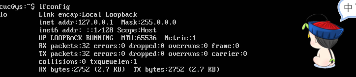  
     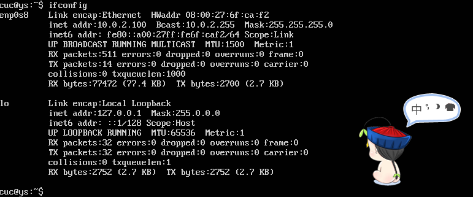  

### DNS
 - [config: /etc/bind/named.conf.options](conf/named.conf.options)
 - [config: /etc/bind/named.conf.local](conf/named.conf.local)
 - [config: /etc/bind/zones/db.cuc.edu.cn](db.cuc.edu.cn)
 - server(10.0.2.11)
   - 安装Bind: sudo apt-get install bind9 bind9utils bind9-doc
   - 设置信任客户端：sudo vi /etc/bind/named.conf.options，添加  
   ```
   acl "trusted" {
      10.0.2.100;    # ns1 - can be set to localhost
   };  
   ```
   - 在options选项中添加  
   ```
   recursion yes;                 # enables resursive queries
    allow-recursion { trusted; };  # allows recursive queries from "trusted" clients
    listen-on { 10.0.2.11; };   # ns1 private IP address - listen on private network only
    allow-transfer { none; };      # disable zone transfers by default

    forwarders {
            8.8.8.8;
            8.8.4.4;
    };
   ```
   - 编辑sudo vi /etc/bind/named.conf.local 添加
   ```
   zone "cuc.edu.cn"{
     type master;
     file "/etc/bind/zones/db.cuc.edu.cn";
   };
   ```
   - sudo mkdir /etc/bind/zones
   - cd /etc/bind/zones
   - sudo cp ../db.local ./db.cuc.edu.cn
   - 编辑sudo vi /etc/bind/zones/db.cuc.edu.cn  
   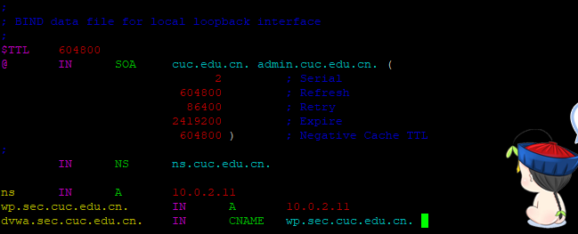
   - 重启bind9：sudo service bind9 restart

- client(10.0.2.100)
  - sudo vi /etc/resolvconf/resolv.conf.d/head  
  
  - 测试  
  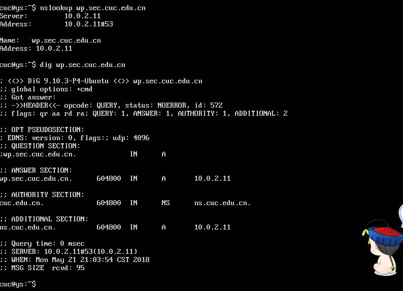
- 参考链接  
[https://www.digitalocean.com/community/tutorials/how-to-configure-bind-as-a-private-network-dns-server-on-ubuntu-14-04#prerequisites](https://www.digitalocean.com/community/tutorials/how-to-configure-bind-as-a-private-network-dns-server-on-ubuntu-14-04#prerequisites)

### Samba
 - [config: /etc/samba/smb.conf](conf/smb.conf)  
 - 修改/etc/samba/smb.conf文件
   - [global]找到全局设置标签[global]，在下面进行配置  
   ```
  workgroup = WORKGROUPhosts
  allow = 192.168.1.11 ;windows主机ip
  ```  
  - 配置最简单访问目录几个基本属性：  
  ```
  [share]      windows客户端查看时看到的文件夹名
path = /var/samba/share      共享目录位置，要系统中存在的目录，也可以配置完再创建
read only = no
public   = yes
  ```
 - 参考链接  
 [https://blog.csdn.net/linglongwunv/article/details/5212919](https://blog.csdn.net/linglongwunv/article/details/5212919)
