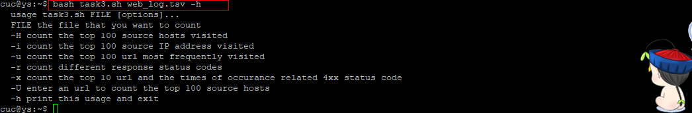

### Linux系统与网络管理 实验报告4
### 实验名称
- SHELL脚本编程基础

### 过程
- 任务一
  - [task1.sh](task1.sh)
  - 用bash编写一个图片批处理脚本，实现以下功能：
    - 支持命令行参数方式使用不同功能  
    
    - 支持对指定目录下所有支持格式的图片文件进行批处理  
    - 支持以下常见图片批处理功能的单独使用或组合使用  
    
      - 支持对jpeg格式图片进行图片质量压缩  
      
      - 支持对jpeg/png/svg格式图片在保持原始宽高比的前提下压缩分辨率  
      
      - 支持对图片批量添加自定义文本水印  
        
      
      - 支持批量重命名（统一添加文件名前缀或后缀，不影响原始文件扩展名）  
        
      
      - 支持将png/svg图片统一转换为jpg格式图片  
        

- 任务二
  - [task2.sh](task2.sh)
  - 用bash编写一个文本批处理脚本，对以下附件分别进行批量处理完成相应的数据统计任务：
    - [2014世界杯运动员数据](http://sec.cuc.edu.cn/huangwei/course/LinuxSysAdmin/exp/chap0x04/worldcupplayerinfo.tsv)
      - 统计不同年龄区间范围（20岁以下、[20-30]、30岁以上）的球员数量、百分比
      - 统计不同场上位置的球员数量、百分比
      - 名字最长的球员是谁？名字最短的球员是谁？
      - 年龄最大的球员是谁？年龄最小的球员是谁？
      - 结果：  
      
      - 统计结果文件：  
        - [task2_ans](task2_ans)

- 任务三
  - [task3.sh](task3.sh)
  - 用bash编写一个文本批处理脚本，对以下附件分别进行批量处理完成相应的数据统计任务：
    - [Web服务器访问日志](http://sec.cuc.edu.cn/huangwei/course/LinuxSysAdmin/exp/chap0x04/web_log.tsv.7z)  
      - usage  
      
      - 统计访问来源主机TOP 100和分别对应出现的总次数  
      
      - 统计访问来源主机TOP 100 IP和分别对应出现的总次数  
      
      - 统计最频繁被访问的URL TOP 100  
      
      - 统计不同响应状态码的出现次数和对应百分比  
      
      - 分别统计不同4XX状态码对应的TOP 10 URL和对应出现的总次数  
      
      - 给定URL输出TOP 100访问来源主机  
      

### 参考链接
[convert](http://zlb1986.iteye.com/blog/778054)  
[sed](http://www.cnblogs.com/edwardlost/archive/2010/09/17/1829145.html)  
[awk](http://www.cnblogs.com/ggjucheng/archive/2013/01/13/2858470.html)
